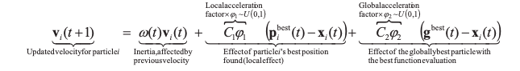

# Particle-Swarm-Optimization
Using PSO to train an agent to balance a pole

PSO is an optimization method in which there is a group of "particles" that each represent an approach to a given problem. As the particles try to find an optimal solution, their behaviors are influenced by the most succesful of the group, causing them to converge, or "swarm", upon such a solution.

###### GIF Source: Wikipedia

###### Velocity Update; Source: High Dimensional Adaptive Particle Swarm Optimization on Heterogeneous Systems

###### Particle Update; Source: High Dimensional Adaptive Particle Swarm Optimization on Heterogeneous Systems

This method is not guaranteed to converge to the global optimal solution. Behavioral changes are governed by velocities affected by parameter selection, to which this method is very sensitive to. The adaptive version addresses this issue. 

I coded the most simple implementation here as well as its adaptive version for a relatively easy environment to solve. Each particle in the swarm is evaluated after playing through an entire episode of the game. A "particle" in this case is a weight matrix that, when multiplied by a given state of the environment outputs, outputs actions to take. 

The adaptive version automatically changes the intertia parameter based on the clustering of particles.

###### Inertia Update; Source: High Dimensional Adaptive Particle Swarm Optimization on Heterogeneous Systems

An inertia of <0.3 indicates swarm convergence and a value of >0.7 indicates the swarm needs to escape local optima. Values between are standard exploration and exploitation.

It also automatically changes the cognitive parameter, which prioritizes a particles behavior towards its own best found strategy, and the social parameter, which will cause a particle to tend more towards the most succesful particle in the swarm. The algorithm does this by changing the swarm strategy by calculating the evolutionary factor, phi in the above equation, and applying a fuzzy clustering to determine which strategies it is in and to transition to. There are four strategies: S1, S2, S3, S4.

###### Source: Adaptive Particle Swarm Optimization (2009)

###### Source: Adaptive Particle Swarm Optimization (2009)

The particle positions in the above image show exploration, exploitation, and a jumping out by the globally best particle, respectively.

The swarm can be in multiple strategy states at once. The transition from one state to the next is defuzzified by the singloid method and a state transition logic scheme.

###### Source: Adaptive Particle Swarm Optimization (2009)

One update that needs to be made to this implementation is the addition of a gaussian perturbance of the globally best particle when it is in a convergent state. There are many variations to this optimization algorithm that I'll add at a later time.

The maximum score for this environment is 500.
